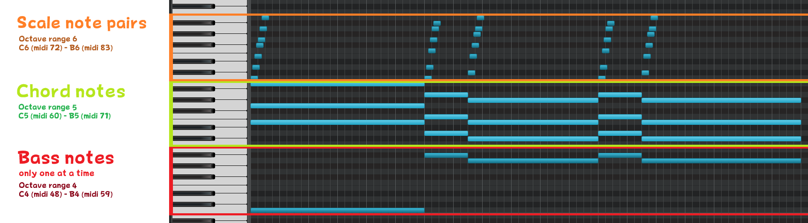
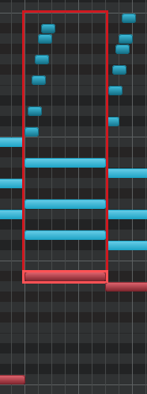

# MIDI-to-BMS-Converter
Converts Midis to *Super Mario Galaxy 1 &amp; 2's* BMS sequence format.

Can also generate timing channels (for beats and CIT usage) and CIT files (chord and scale for effects).

## Usage
Drag and drop your Midi on one of the bat files or use command line usage:
`python MIDI-to-BMS.py Input.mid Output.bms LogarithmicConvert?`

Example: `python MIDI-to-BMS.py HappyBirthday.mid ToYou.bms True`
### Instruments
The instrument and bank values defined in the Midi are transferred directly to the BMS.
For example, if you have mixed a Midi with the soundfont file extracted from the game, the exact same instruments will also be used in the BMS.
Provided that your DAW/midi editor also exports them!

If there are no Bank Select commands in the Midi, the game will use bank 0 as default.
### Looping
Place markers with the names **LoopStart** and **LoopEnd** in your midi to define loop points.
If you want the song to be repeated in its entirety, add a marker with the name **LoopAll** in the midi.
If none of these markers are in the midi, the song will simply end.

Note that if you have a **LoopAll** but also a **LoopStart** and **LoopEnd** marker in the midi, it will use the loop points instead of looping the whole song.

### Midi Controllers
Currently, the following midi controllers will be imported to the BMS:

#### Basic
- **CC 07** Channel Volume
- **CC 10** Pan

#### Effects
- **CC 91** Reverb (Wet/Dry)
- **CC 92** Tremolo (Wet/Dry)
- **CC 93** Tremolo (Rate) - If CC 92 is used but not this one, the game will use a default value of 50%
- **CC 01** Vibrato (Wet/Dry)
- **CC 02** Vibrato (Rate) - If CC 1 is used but not this one, the game will use a default value of 50%

Pitch Wheel and BPM changes during the song are also supported.

### Logarithmic
Super Mario Galaxy's Synthesizer uses logarithmic volume relation. So if your midi was created with a Synthesizer with linear volume ratios, you can enter "True" in place of ***LogarithmicConvert?*** in command line (or use the bat file per drag and drop) to have the BMS converted logarithmic values.

### PPQN
Currently, the PPQN (the "resolution" of a Midi) will be converted to 120 by default in the exported BMS, which is the standard of the Galaxy games.

### Timing-Channel and CIT Generation
Beat data for timing things like beat blocks, as well as associated chord and scale data for effects such as item jingles can be generated as follows:
#### Timing/Beat
Add a marker called **BEAT_4/4** for a four-quarter time song or a **BEAT_3/4** for a three-quarter time song to the midi at any location.

This also tells the script that it should generate this at all.
#### Chord and Scales
Chords and scale note pairs are defined in the Midi as follows. These notes must be on a track for channel 0. Any other channel is not used for this.

##### Bass Note
Is defined in octave range 5 (C4 (midi 48) - B4 (midi 59)). Only one is allowed per chord and scale set.

The length of the note is also defined as the range in which the chord and scale notes are taken into account. As shown in the picture:

##### Chord Notes
Are defined in the octave range 6 (C5 (midi 60) - B5 (midi 71)). Up to X notes are possible.

##### Scale Note Pairs
Are specified in octave range 7 (C6 (midi 72) - B6 (midi 83)).

Converting:
If you now convert the midi, additional information is displayed, such as chords and scalepair notes.
At the end bla in Multi BGM Liste einfügen.

infos zu intobeat, loopbeat. wie man bms und cit ins spiel einfügt.

## Preparation
You need:
* **Python**
* **Mido Python Module**

To install Mido, open command line and enter ***pip install mido*** 

The Bat files with "compressed" requires path to a compress tool, such as yaz0enc.exe from [RARC Tools](https://kuribo64.net/get.php?id=5c98RKoV3uJdGBin). Open the Bat with a text editor and replace "C:\Tools\yaz0enc.exe" with path to the exe.

## Plans for Updates
* Control about BMS-only events (such as jumping to other parts of the song) via Markers or similar

## Special Thanks wip
SY28, Super Hackio und Xayrga for documenting BMS format
TZGaming

