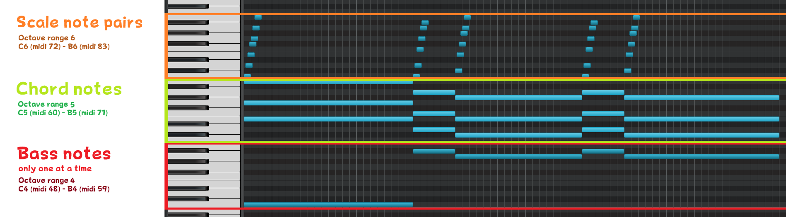
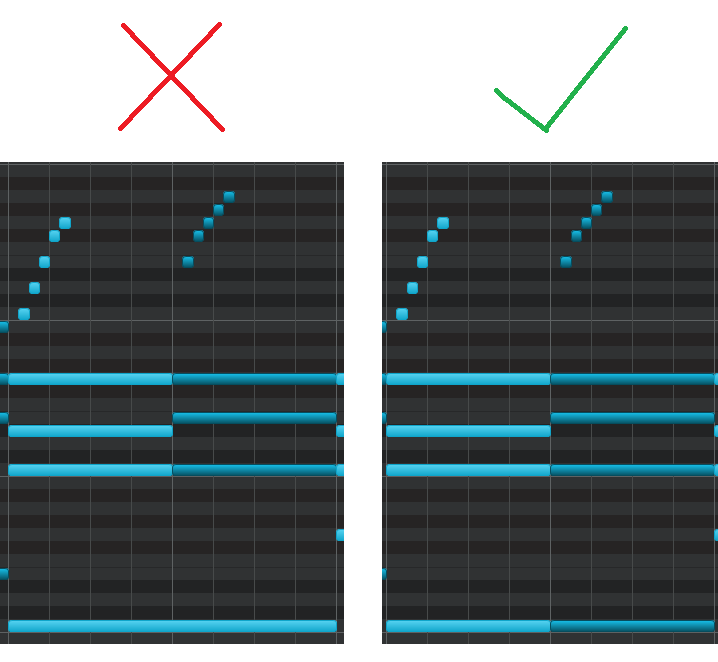
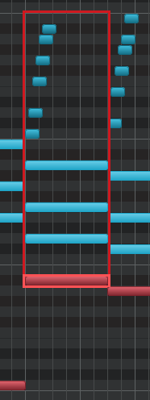

# MIDI-to-BMS-Converter
Converts Midis to JAudio2 BMS sequence format, used by Wii and GameCube games like *Super Mario Galaxy 1 &amp; 2's* and *The Legend of Zelda: Twilight Princess*.

Can also generate Mario Galaxy timing tracks (for beats and CIT usage) and CIT files (chord and scale for effects).

## Usage
Drag and drop your Midi on one of the bat files or use command line usage:
`python MIDI-to-BMS.py Input.mid Output.bms LogarithmicConvert? ForTwilightPrincess?`

- **LogarithmicConvert?** *True* if you want to convert from linear to logarithmic volume ratios (rare situation), otherwise *False* 
- **ForTwilightPrincess?** If *True* it adds an F9 command ("JASSeqParser::cmdSyncCPU") to each channel which is required for *Twilight Princess*, otherwise *False*

Example: python MIDI-to-BMS.py HappyBirthday.mid ToYou.bms True False
### Instruments
The instrument event values defined in the Midi (Program Change, Bank Select (MSB and LSB)) are transferred directly to the BMS.

So if you have mixed a Midi with the soundfont file extracted from the game, the same instruments will also be used in the BMS.
Provided that your DAW/midi editor also exports them!

💡 If there are no Bank Select commands in the Midi, the game will use bank 0 as default.

#### Bank Enlarge Function
Unlike MIDI, the BMS format can process program change values up to 255, which is used in some cases like The Legend of Zelda: Twilight Princess.

In such a case, you can use the **Bank Enlarge Function** described below.

(A little tutorial on how to extract the soundfont from the game for DAW use will be coming soon.)
### Synthesizer Info
The game uses a sample based synth with oscillators, [find more technical info here](https://web.archive.org/web/20241104204514/https://xayr.gay/wiki/IBNK).
* It can play up to 7 notes simultaneously per channel.
* The game supports ‘voice stacking’, meaning you can play simultaneous instances of the same note (with the same pitch).

### Looping
Place markers with the names **LoopStart** and **LoopEnd** in your midi to define loop points.
If you want the song to be repeated in its entirety, add a marker with the name **LoopAll** in the midi.
If none of these markers are in the midi, the song will simply end.

❕ Note that if you have a **LoopAll** but also a **LoopStart** and **LoopEnd** marker in the midi, it will use the loop points instead of looping the whole song.

❕ If a note has NoteOn before the LoopEnd marker and NoteOff after it, the NoteOff will never occur. This can best be tested with a DAW with a loop function.

### Midi Controllers & Other Events
Currently, the following midi controllers will be imported to the BMS:

#### Basic
- **CC 00** Bank Select (MSB)
- **CC 07** Channel Volume
- **CC 10** Pan

#### Effects
- **CC 91** Reverb (Wet/Dry)
- **CC 92** Tremolo (Wet/Dry)
- **CC 93** Tremolo (Rate) - If CC 92 is used but not this one, the game will use a default value of 50%
- **CC 01** Vibrato (Wet/Dry)
- **CC 02** Vibrato (Rate) - If CC 1 is used but not this one, the game will use a default value of 50%

#### Pitch Wheel & Sensitivity
Pitchwheel is also supported.
Additionally it can be used in combination with RPN Pitch Bend Sensitivity.

However, only an RPN value of up to 6579 is supported. It is recommended to use only an RPN value of 5000 or less, as higher values will lead to incorrect results.

#### Misc
BPM changes during the song are also supported.

### Logarithmic
Super Mario Galaxy's Synthesizer uses logarithmic volume relation. So if your midi was created with a Synthesizer with linear volume ratios, you can enter "True" in place of ***LogarithmicConvert?*** in command line (or use the bat file per drag and drop) to have the BMS converted logarithmic values.

### PPQN
Currently, the PPQN (the "resolution" of a Midi) will be converted to 120 by default in the exported BMS, which is the standard of the Galaxy games.

### Bank Enlarge Function (Program Change > 127)

Unlike MIDI, the BMS format can process program change values up to 255.
Some games, such as The Legend of Zelda: Twilight Princess, actively use this extended range.

However, since MIDI only supports Program Change 0–127 per bank, instruments with higher program numbers must be split up.

#### Preparing your soundfont/instrument collection

Instruments with program numbers above 127 must be moved to an additional, free bank in your soundfont or similar.
The new bank will then contain only the “overflow” instruments, with the program number being minus 128 in each case:

|Original BMS Program|New SF2 Program|
|-|-|
|128|0|
|129|1|
|134|6|

#### Setting markers in the MIDI

A marker is used in the MIDI so that the tool knows which MIDI bank should be expanded to which BMS bank.

**Marker format:** "BankEnlarge_MIDIBankX=BMSBankY”
- X = The new MIDI bank containing the outsourced instruments (0–127)
- Y = The original bank in the game (BMS bank) using programs 0–255

Multiple markers are allowed if multiple banks are to be expanded.

The tool automatically recognizes the defined bank pairs and maps MIDI program change 0–127 to BMS program change 128–255 and also sets the correct bank and instrument assignment in BMS format

Everything remains compatible for MIDI, the expansion takes place entirely during conversion.

##### Example
In Twilight Princess, banks 11, 52, and 53 have more than 127 patches, so the banks are split into two banks each:

|Original BMS|New SF2|
|-|-|
|BMS Bank 11 Part 1 [Program   0 - 127]|SF2 Bank 11|
|BMS Bank 11 Part 2 [Program 128 - 239]|SF2 Bank 101|
|-|-|
|BMS Bank 52 Part 1 [Program   0 - 127]|SF2 Bank 52|
|BMS Bank 52 Part 2 [Program 128 - 160]|SF2 Bank 102|
|-|-|
|BMS Bank 53 Part 1 [Program   0 - 127]|SF2 Bank 53|
|BMS Bank 53 Part 2 [Program 128 - 134]|SF2 Bank 103|

And to ensure that it is mapped correctly, these 3 markers are added to each MIDI file to be converted:
- BankEnlarge_MIDIBank101=BMSBank11
- BankEnlarge_MIDIBank102=BMSBank52
- BankEnlarge_MIDIBank103=BMSBank53

[Example Midi](https://kuribo64.net/get.php?id=ILKzVVdTy1yBHYZF)

### 🎹 Timing and CIT Data Generation
[Example Midis can be found here](https://kuribo64.net/get.php?id=a4CYBEd7UATFY33s)

Beat data for timing things like beat blocks, as well as associated chord and note scale data for effects such as item jingles can be generated as follows.

💡 If you want to use this with a streamed song (AST), you can load the song into your DAW to define the chords. Make sure you use the same BPM and loop positions as the streamed song. BPM changes during the song are also supported, but they need to be the same as the streamed song!

#### Timing/Beat
To enable timing and chord generation for your midi, add a marker called **BEAT** to the midi at any location.
The time signature set in MIDI is adopted directly.

The following time signatures are supported:
- **5/4**
- **4/4**
- **3/4**
- **2/4**
- **1/4** (useful for intros, before the actual measure begins)

💡 Time signature changes, e.g. from 3/4 to 4/4 in the middle of a song, are supported.

❗️ Abnormal positions of time signature changes in MIDI that do not align properly with the measure and result in incomplete measures are not supported. Most DAWs typically save these automatically with proper snapping, but some, such as MidiEditor, do not.

#### Jingle Speed
Optionally, you can slow down the playback speed of jingles. This is useful if the song has a high BPM, which causes the jingles to play back unusually fast.

To do this, insert a marker at any point with the following name:

- **RATE_3/4** Slows down jingle speed to three-quarters (x 0.75)
- **RATE_2/4** Slows jingle speed by half
- **RATE_1/4** Slows the speed down to a quarter of its original speed (x 0.25)
- ***No Marker*** Leave the speed as is.

#### Chord and Scales
Chords and scale note pairs are defined in the Midi as follows. These notes must be on a track for channel 0. Any other channel is not used for this.

❗️All chord sections must be clearly separated from each other. Even if two consecutive chords have the same notes, they must still appear twice, as shown in the image here:

##### Bass Note
Defines the harmonic basis for the chord. This is necessary for each chord set.

Is defined in *octave range 5 (C4 (midi 48) - B4 (midi 59))*. Only one is allowed per chord and scale set.

❗️The length of the bass note is also defined as the range in which the chord and scale notes are taken into account. As shown in the picture:

##### Chord Notes
Chords whose notes are used by objects such as blue flip panels, as well as for menu sounds and 2-player luma.

Are defined in *octave range 6 (C5 (midi 60) - B5 (midi 71))*. Up to 7 notes are possible.

##### Scale Note Pairs
Music scales or harmonic ladder. These are mainly used for melody jingles such as Coin-Appear or Sling stars.
These notes are defined in ascending order in the midi.

Are specified in *octave range 7 (C6 (midi 72) - B6 (midi 83))*.

#### Converting
When converting a prepared Midi, additional information, including the notes, is displayed. You can scroll through it to look for possible mistakes, e.g. if a bass note accidentally protrudes into the wrong chord.

💡 At the end you will get a *IntoBeat* and *LoopBeat* value, which you need to enter in the MultiBgmInfo for your song, if it is meant for combination with streamed AST (Multi-BGM). If it is an BMS-only song, you can ignore these values.

#### Additional Notes
* If you want to use your timing and chord data for a streamed song, the song must be in AST format at 32000 Hz.
* The timing track is automatically ‘compressed’ (using subcalls), which saves a lot of storage space without losing any data.

## Preparation
You need:
* **Python**
* **Mido Python Module**

To install Mido, open command line and enter ***pip install mido*** 

The Bat files with "compressed" requires path to a compress tool, such as yaz0enc.exe from [RARC Tools](https://kuribo64.net/get.php?id=5c98RKoV3uJdGBin). Open the Bat with a text editor and replace "C:\Tools\yaz0enc.exe" with path to the exe.

## Plans for Updates
* Control about BMS-only events (such as jumping to other parts of the song) via Markers or similar
* Compression for channels other than the timing channel. (using subcalls)

## Special Thanks
* **SY24, Super Hackio and Xayrga** for documenting BMS format
* **TZGaming** for some tipps about the game's soundfont
* **VGMTrans Team** for their helpful tool that helped analysing the format
* **Carla** for their helpful modular audio plugin host, that allows for great soundfont and effects usage in any daw!
